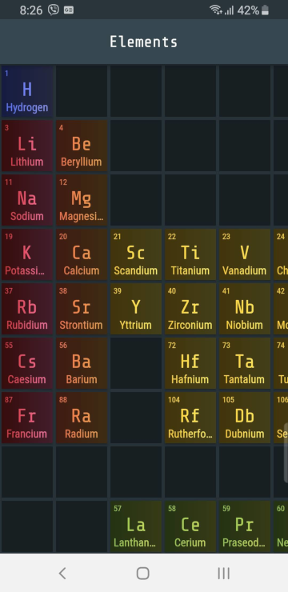
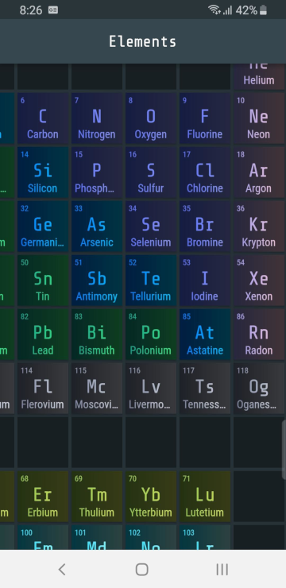
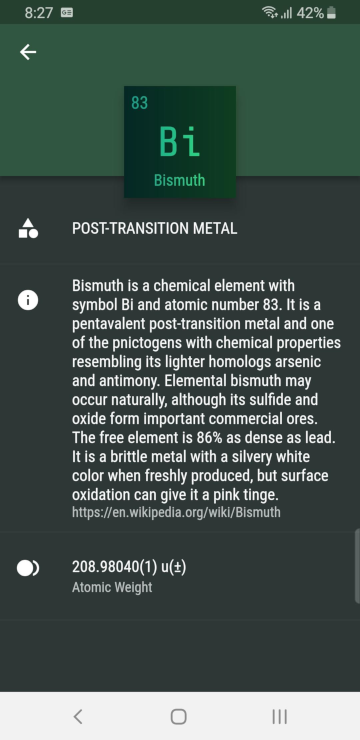
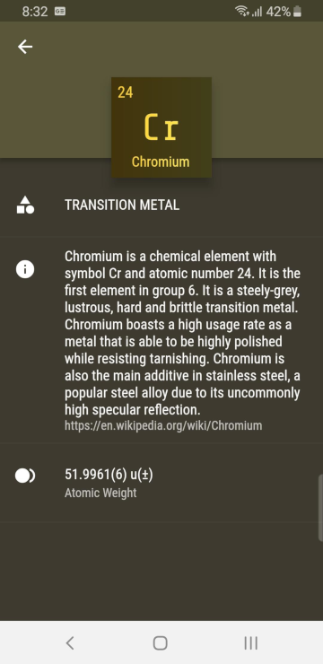

#  Elements

Browse the elements of the periodic table!

Elements is a Flutter app developed for the Flutter Create 2019 contest. The app lets you browse the chemical elements of the Periodic Table. It also includes helpful snippets of information about each element.

This is a cross-platform app that runs on both Android and iOS.


## Getting Started

This application can be run as is via

```
flutter run --release
```

The included dart script, `buildJson.dart`, can be run to generate a new `elementsGrid.json` file in the assets folder, to be used directly by the application. The script will automatically download a short Wikipedia extract and merge it with IUPAC-provided chemical element information and app-specific color values.


## Screenshots






## Code

``` dart
import 'dart:convert';

import 'package:flutter/material.dart';
import 'package:flutter/services.dart';


const kRowCount = 10;

const kContentSize = 64.0;
const kGutterWidth = 2.0;

const kGutterInset = EdgeInsets.all(kGutterWidth);


void main() {
  final gridList = rootBundle.loadString('assets/elementsGrid.json')
      .then((source) => jsonDecode(source)['elements'] as List)
      .then((list) => list.map((json) => json != null ? ElementData.fromJson(json) : null).toList());

  runApp(ElementsApp(gridList));
}


class ElementData {

  final String name, category, symbol, extract, source, atomicWeight;
  final int number;
  final List<Color> colors;

  ElementData.fromJson(Map<String, dynamic> json)
      : name = json['name'], category = json['category'], symbol = json['symbol'],
        extract = json['extract'], source = json['source'],
        atomicWeight = json['atomic_weight'], number = json['number'],
        colors = (json['colors'] as List).map((value) => Color(value)).toList();
}


class ElementsApp extends StatelessWidget {
  ElementsApp(this.gridList);

  final Future<List<ElementData>> gridList;

  @override
  Widget build(BuildContext context) {
    final theme = ThemeData(
      brightness: Brightness.dark,
      accentColor: Colors.grey,

      textTheme: Typography.whiteMountainView.apply(fontFamily: 'Roboto Condensed'),
      primaryTextTheme: Typography.whiteMountainView.apply(fontFamily: 'Share Tech Mono'),
    );

    return MaterialApp(title: 'Elements', theme: theme, home: TablePage(gridList));
  }
}

class TablePage extends StatelessWidget {
  TablePage(this.gridList);

  final Future<List<ElementData>> gridList;

  @override
  Widget build(BuildContext context) {
    return Scaffold(
      backgroundColor: Colors.blueGrey[900],
      appBar: AppBar(title: Text('Elements'), centerTitle: true, backgroundColor: Colors.blueGrey[800]),
      body: FutureBuilder(
        future: gridList,
        builder: (_, snapshot) => snapshot.hasData ? _buildTable(snapshot.data)
            : Center(child: CircularProgressIndicator()),
      ),
    );
  }

  Widget _buildTable(List<ElementData> elements) {
    final tiles = elements.map((element) => element != null ? ElementTile(element)
        : Container(color: Colors.black38, margin: kGutterInset)).toList();

    return SingleChildScrollView(
      child: SizedBox(height: kRowCount * (kContentSize + (kGutterWidth * 2)),
        child: GridView.count(crossAxisCount: kRowCount, children: tiles,
          scrollDirection: Axis.horizontal,),),);
  }
}

class DetailPage extends StatelessWidget {
  DetailPage(this.element);

  final ElementData element;

  @override
  Widget build(BuildContext context) {
    final listItems = <Widget>[
      ListTile(leading: Icon(Icons.category), title : Text(element.category.toUpperCase())),
      ListTile(leading: Icon(Icons.info), title : Text(element.extract),
        subtitle: Text(element.source),),
      ListTile(leading: Icon(Icons.fiber_smart_record), title: Text(element.atomicWeight),
        subtitle: Text('Atomic Weight'),),
    ].expand((widget) => [widget, Divider()]).toList();

    return Scaffold(
      backgroundColor: Color.lerp(Colors.grey[850], element.colors[0], 0.07),

      appBar: AppBar(
        backgroundColor: Color.lerp(Colors.grey[850], element.colors[1], 0.2),
        bottom: ElementTile(element, isLarge: true),),

      body: ListView(padding: EdgeInsets.only(top: 24.0), children: listItems),
    );
  }
}


class ElementTile extends StatelessWidget implements PreferredSizeWidget {
  const ElementTile(this.element, { this.isLarge = false });

  final ElementData element;
  final bool isLarge;

  Size get preferredSize => Size.fromHeight(kContentSize * 1.5);

  @override
  Widget build(BuildContext context) {
    final tileText = <Widget>[
      Align(alignment: AlignmentDirectional.centerStart,
        child: Text('${element.number}', style: TextStyle(fontSize: 10.0)),),
      Text(element.symbol, style: Theme.of(context).primaryTextTheme.headline),
      Text(element.name, maxLines: 1, overflow: TextOverflow.ellipsis,
        textScaleFactor: isLarge ? 0.65 : 1,),
    ];

    final tile = Container(
      margin: kGutterInset,
      width: kContentSize,
      height: kContentSize,
      foregroundDecoration: BoxDecoration(
        gradient: LinearGradient(colors: element.colors),
        backgroundBlendMode: BlendMode.multiply,),
      child: RawMaterialButton(
        onPressed: !isLarge ? () => Navigator.push(context,
            MaterialPageRoute(builder: (_) => DetailPage(element))) : null,
        fillColor: Colors.grey[800],
        disabledElevation: 10.0,
        padding: kGutterInset * 2.0,
        child: Column(mainAxisAlignment: MainAxisAlignment.spaceBetween, children: tileText),
      ),
    );

    return Hero(
      tag: 'hero-${element.symbol}',
      flightShuttleBuilder: (_, anim, __, ___, ____) =>
          ScaleTransition(scale: anim.drive(Tween(begin: 1, end: 1.75)), child: tile),
      child: Transform.scale(scale: isLarge ? 1.75 : 1, child: tile),
    );
  }
}
``` 

###### Total Dart Code Size: 5102 bytes


### Thanks to
- **Google Flutter Team**
- **Wikimedia Foundation** - Summary extracts from Wikipedia
- **IUPAC** - Chemical element information
- **Cathy and Joe** for letting me use their laptop and wifi, respectively